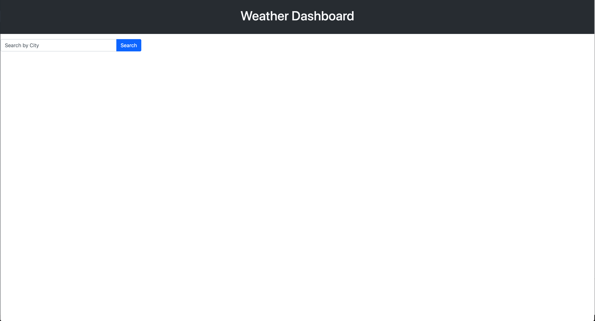
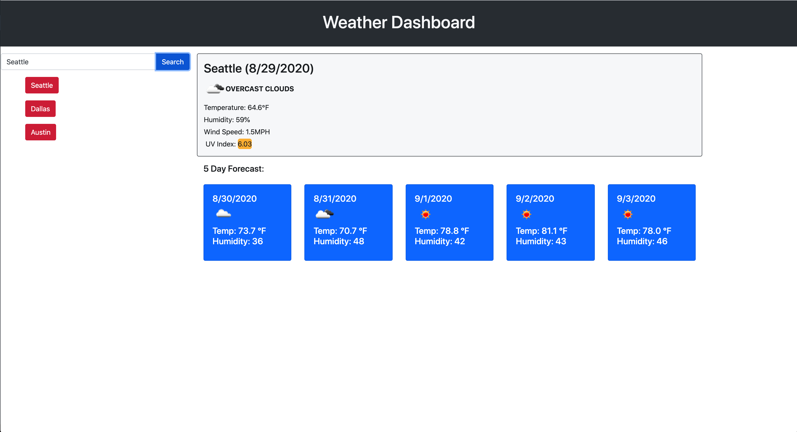

# Weather Dashboard

## Description

A simple weather dashboard application for retrieving weather data from a particular city

## Instructions
```
Input a city name and press "Search"

Weather data is displayed in two forms, current day and future five day forecasts.

UV Index data is color coded based on severity:

Green: LOW
Yellow: MODERATE
Orange: HIGH
Red: VERY HIGH
Violet: EXTREME

You may view historical city results by pressing the collrelating city button in history
```

## Screenshots




## Review

* Deployed Application - 06-Weather-Dashboard - https://smrodriguez88.github.io/06-Weather-Dashboard

* Github Repository - 06-Weather-Dashboard - https://github.com/smrodriguez88/06-Weather-Dashboard
